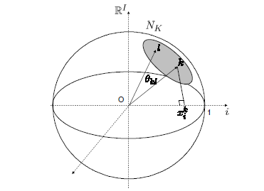
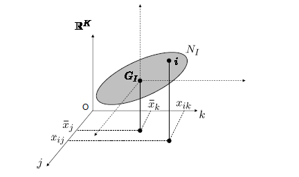

\usepackage{color}
<style>
body {
text-align: justify;
font-size: 12px}
</style>

<style>
.nav>li>a {
    position: relative;
    display: block;
    padding: 10px 15px;
    color: #0A2687;
}
.nav-pills>li.active>a, .nav-pills>li.active>a:hover, .nav-pills>li.active>a:focus {
    color: #ffffff;
    background-color: #09C2BC;
}
</style>


```{r setup, include=FALSE}
knitr::opts_chunk$set(echo = FALSE, message = FALSE, cache = FALSE, warning = FALSE)
knitr::opts_knit$set(root.dir = rprojroot::find_rstudio_root_file())
setwd(here::here())
options(encoding = "UTF8")
```


```{r, echo = FALSE, results=FALSE}
#Font Stlye
require(showtext)
library(extrafont)
windowsFonts()
```

# Indice de Marginación   

Desde hace 25 años el Consejo Nacional de Población (CONAPO), ha ido estimado el índice de marginación a partir de los censos y conteos nacionales, donde el principal interés es dar un resumen de las carencias de los servicios que la población padece desde las distintas unidades de desagregación en México.        

## Acercamientos     

- El índice de marginación (`CONAPO`), enfatiza la cuestión territorial, la población que vive territorios marginados.   

- La medición multidimensional de la pobreza (`CONEVAL`), establece los umbrales de línea de pobreza, necesidades insatisfechas donde se identifican a las personas en condición de pobreza.       

- El índice de desarrollo humano (`PNUD`), aborda la temática de la desigualdad desde la perspectiva de las unidades territoriales.       


## Definición de marginación

En 1990, el Consejo Nacional de Población CONAPO definió la marginación como "un proceso estructural en relación con el desarrollo socioeconómico alcanzado por nuestro país, que dificulta la propagación del progreso a todos los grupos sociales, lo cual repercute en la estructura productiva y se expresa en desigualdades territoriales”. (CONAPO, 2015).    


Estas desigualdades estructurales se pueden referir a diferentes enfoques multidimensionales de la marginación, las cuales una de las  causas principales de esta son:    

- **Marginación social. -**  Situación que vive un individuo o grupo social cuando no es considerado parte de la sociedad en términos políticos, económicos, profesionales o sociales. La característica más común es la carencia de oportunidades y la privación e inaccesibilidad a bienes y servicios básicos para el bienestar social.         

- **Marginación por desventaja económica. -** Situación en la que vive un individuo o grupo social debido a la falta de recursos económicos como la falta de empleo o la precariedad laboral y de vivienda que propicia que sean susceptibles a situaciones de vulnerabilidad.      

- **Marginación por desventajas culturales. -** Situación en la que viven individuo o grupo social debido a condiciones como el analfabetismo, la escasa formación y educación, contrastes de valores entre campo y ciudad, entre otros factores. Generando situaciones de inadaptación y vulnerabilidad.

La [Unión Europea]( http://bibliotecavirtual.clacso.org.ar/ar/libros/clacso/crop/glosario/m.pdf) utiliza el término a veces para referirse al proceso de expulsión hacia los márgenes de la sociedad o de los procesos económicos. En ambos sentidos la marginalidad puede entenderse como exclusión.      

>Por lo que se viene utilizando los términos ‘marginalización ‘y ‘exclusión social’ para referirse a las formas más severas de pobreza. 

**Exclusión social**, se refiere a la acción y al efecto de impedir la participación de ciertas categorías de personas en aspectos considerados como valiosos de la vida colectiva. las principales formas de exclusión refiere a:   


- Situaciones en la cuál es la población está fuera de la sociedad, a través de la no inclusión en sistemas de protección social.     

- Situaciones, como la pobreza y la discapacidad, en las que la población no puede participar en actividades comunes y corrientes.   

- Situaciones en las cuales la población es silenciada, ya sea por medio del estigma o de la discriminación.    


### Objetivo  

- Permitir identificar aquellas áreas que aún carecen de servicios básicos y tener un acercamiento al conocimiento de la desigualdad regional.    


## Problemática    

- El índice se estima con la técnica estadística de componentes principales y una de las problemáticas es que a pesar de que la técnica de componentes principales empleada es robusta y permite la clasificación de las unidades territoriales. Los resultados no son comparables en el tiempo, casi puesto que el cálculo es particular a cada ejercicio y la estratificación depende única y exclusivamente de la variabilidad de los datos.     

- La relación entre las variables desde 1990, eran considerablemente altas, pero qué sucede que conforme van pasando los años la relación entre las variables han ido perdiendo esta fuerza en la interrelación (debido a ciertas mejoras que ha habido en la calidad de vida), lo que ocasiona que el modelo no se apegue muy bien a la primera componente principal. Lo que es importante recordar que el ejercicio del índice de imaginación se hace en relación con la primera componente principal, por lo que con el paso del tiempo la información retenida es cada vez menor.

    

```{r, echo = FALSE}
require(ggplot2)
require(ggpubr)
require(dplyr)
require(stratification)
require(FactoMineR)
require(knitr)
require(magrittr)
require(kableExtra)
require(stringr)
require(factoextra)
require(corrplot)
require(knitr)
require(kableExtra)
require(data.table)
require(Hmisc)
require(stringr)
```


```{r}
 normalize_names = function(nombres, remove_punct = T){
    text = nombres
    if(remove_punct){text = gsub('[[:punct:]]', '', nombres, perl = T)} 
   ### si remove punct=TRUE entoces mi base tiene caracteres de puntuacion [[:punct:]], sustituyelos por un (""), estrayendolos de la variable nombre, 
   ### perl=TRUE indica hay caracteres que NO son de ASCII
    text %>%
      str_trim(., 'both') %>% ####str_trim.-recorta los espacios en blanco desde el inicio y el final de la cadena 
      gsub(' ', ' ', .) %>% ### (.) es una variable cita para crear una lista de expresiones NO evaluadas para evaluarlas después 
      toupper(.) %>% ### tolower() traducre caracteres en vectores de caracteres, en particular de mayusculas a minusculas o viceversa
      gsub('ú', 'u', .) %>%
      gsub('ü', 'u', .) %>%
      gsub('á', 'a', .) %>% 
      gsub('ó', 'o', .) %>%
      gsub('é', 'e', .) %>%
      gsub('í', 'i', .) %>%
      gsub('ñ', 'ni', .)
  }
```

## Base de datos   

Para la estimación del índice de marginación, se identifican 4 dimensiones para resumir el fenómeno: `Educación`, `vivienda`, `ingresos monetarios` y `ubicación espacial`.          

```{r}
tabla <- data.frame("Dimensiones" = c(rep("Educación",2),rep("Vivienda",5),"Distribución de la población","Ingresos monetarios"), "Exclusión"= c("Analfabetismo","Población sin primaria","Viviendas particulares sin drenaje ni servicio sanitario","Viviendas particulares sin energía eléctrica","Viviendas particulaes sin agua entubada","Viviendas particulares con algún nivel de hacinamiento","Viviendas particulares con piso de tierra","Localidades con menos de 5 000 habitantes","Población ocupada que percibe hasta ods salarios"),"Indicador"= c("Porcentaje de población analfabeta de 15 años o más","Porcentaje de población sin primaria completa de 15 años o más","Porcentaje de ocupantes en viviendas sin drenaje ni servicio sanitario","Porcentaje de ocupantes en viviendas sin energía eléctrica","Porcentaje de ocupantes en viviendas sin agua entubada","Porcentaje de viviendas con algún nivel de hacinamiento","Porcentaje de ocupantes en viviendas con piso de tierra","Porcentaje de población en localidades con menos de 5 mil habitantes","Porcentaje de población ocupada con ingresos de hasta 2 salarios mínimos"))

x<-tabla %>%
      kable(align = "c",
              col.names = c("Dimensiones socioeconómicas","Formas de exclusión","Indicador para medir la intensidad de la exlusión"),
            caption = "Esquema conceptual de marginación") %>%
        kable_styling(full_width = F, 
                        bootstrap_options =c("striped","condensed","bordered","hover"),
                          position = "center",
                            latex_options = c("scale_down")) %>%
             collapse_rows(columns = 1, valign = "top") %>%
              row_spec(0, color = "#031a3f",background = "#09C2BC", bold = TRUE) %>%
               column_spec(1, bold = TRUE) 
add_footnote(x, c("Source: CONAPO (2012)"), notation = "symbol")
```

La base de datos del índice de marginación por municipio 1990-2015 se encuentra disponible en la página de [datos abiertos](https://datos.gob.mx/).    

Las variables que se usaron para el análisis de componentes principales, mismas que conforman el índice de marginación a nivel municipal fueron:  

```{r}
tabla <- data.frame("Nomenclatura" = c("ANALF","SPRIM","OVSDE","OVSEE","OVSAE","VHAC","OVPT","PL.5000","PO2SM"),
                    "Definición" = c("Analfabetismo","Población sin primaria","Viviendas particulares sin drenaje ni servicio sanitario","Viviendas particulares sin energía eléctrica","Viviendas particulaes sin agua entubada","Viviendas particulares con algún nivel de hacinamiento","Viviendas particulares con piso de tierra","Localidades con menos de 5 000 habitantes","Población ocupada que percibe hasta ods salarios"))

tabla %>%
      kable(align = "c",
            caption = "Indicadores sociodemográficos a nivel municipal") %>%
        kable_styling(full_width = F, 
                        bootstrap_options =c("striped", "condensed", "bordered", "hover"),
                          position = "center") %>%
       row_spec(0, color = "#031a3f",background = "#09C2BC", bold = TRUE) %>%
       column_spec(1, bold = TRUE) 
```
 
# Análisis de Componentes Principales (ACP) {.tabset .tabset-pills}  

La idea central del análisis de componentes principales (`PCA`) es reducir la dimensionalidad de un conjunto de datos que consta de un gran número de variables interrelacionadas, mientras se retiene la mayor cantidad posible de la variación presente en el conjunto de datos. Esto se logra transformando a un nuevo conjunto de variables, las *componentes principales* (`PC`), que no están correlacionadas y que están ordenadas de manera que los primeros retengan la mayor parte de la variación presente en todas las variables originales.  


## Estructura

**Definiciones y derivaciones de componentes principales**[^1]

[^1]:(Springer, I. T. J. (2002). Principal Component Analysis, Second Edition.)

Sea $x$  un vector de $p$ variables aleatorias, y que las varianzas de las $p$ variables aleatorias y la estructura de las covarianzas o correlaciones entre las $p$ variables son de interés. A menos que $p$ sea pequeño, o que la estructura sea muy simple, a menudo no será muy útil observar simplemente las $p$ varianzas y todas las $\frac{1}{2}p (p - 1)$ correlaciones o covarianzas. Una alternativa es buscar algunas variables derivadas que conserven la mayor parte de la información proporcionada por estas varianzas y correlaciones o covarianzas.  

Aunque PCA no ignora las covarianzas y correlaciones, se concentra en las variaciones. El primer paso es buscar una función lineal $\alpha_{1}^{'}x$ de los elementos de $x$ que tengan la varianza máxima, donde $\alpha_{1}^{'}$ es un vector de $p$ constantes $\alpha_{11},\alpha_{12},...,\alpha_{1p}$ y el signo $'$ denota transposición, de modo que:    

$$\alpha_{1}^{'}x =\alpha_{11}x_{1} + \alpha_{12}x_{2} + ...,+ \alpha_{1p}x_{p} = \sum_{j=1}^{p}\alpha_{1j}x_{j}$$

A continuación, se busca una función lineal $\alpha_{2}^{'}x$, que este no correlacionada con $\alpha_{1}^{'}x$ y que tenga una varianza máxima, y así sucesivamente, de modo que en la *k-ésima* etapa se encuentre una función lineal $\alpha_{k}^{'}x$ que tenga la varianza máxima sujeta a no estar correlacionada con $\alpha_{1}^{'}x, \alpha_{2}^{'}x, ...,\alpha_{k-1}^{'}x$. La *k-ésima* variable derivada, $\alpha_{k}^{'}x$ donde esta sería la *k-ésima* *componente principal*. Y por consiguiente se podrían encontrar $p$ *componentes principales*, pero se espera en general, que la mayor parte de la variación en $x$ sea explicada por las primeras $m$ *componentes principales*, donde $m\ll  p$.    

Suponiendo por el momento, el caso en el que el vector $x$ tiene una matriz de covarianza conocida $\Sigma$. Esta es la matriz de cuyo elemento $(i, j)$ es la `matriz de covarianza` entre los elementos $i$ y $j$ de $x$ cuando $i \neq j$, y la `matriz de varianza` de los  elementos $i$ y $j$ de $x$ cuando $i = j$. El caso más común, es cuando $\Sigma$ es desconocido y es reemplazando por una matriz de covarianza de muestra $S$. Resulta que para $k = 1, 2, ···, p$, la k-ésima componente principal viene dado por $z_{k}=\alpha'_{k}x$ donde $\alpha_{k}$ es un vector propio (`eigenvector`) de $\Sigma$ correspondiente a su *k-ésimo* valor propio (`eigenvalue`) más grande $\lambda_{k}$. Además, si se elige que $\alpha_{k}$ tenga una unidad de longitud ($\alpha'_{k}\alpha_{k}=1$), entonces $var(z_{k}) = \lambda_{k}$, donde $var(z_{k})$ se denota como la varianza de $z_{k}$.  


Para obtener la forma de las *componentes principales*, se considera primero $\alpha'_{1}x$; donde el vector $\alpha_{1}$ maximiza $var[\alpha'_{1}x] = \alpha'_{1}\Sigma \alpha_{1}$. Está claro que, tal como está, no se alcanzará el máximo finito para $\alpha_{1}$, por lo que debe establecerse una restricción de normalización.    

La restricción utilizada en la derivación es $\alpha'_{1} \alpha_{1}=1$, es decir, la suma de los cuadrados de los elementos de $\alpha_{1}$ es igual a $1$. Para poder maximizar $\alpha'_{1}\Sigma \alpha_{1}$ sujeto a $\alpha'_{1} \alpha_{1}=1$, el enfoque estándar es utilizar la técnica de los *multiplicadores de Lagrange* que maximiza:  

$$\alpha_{1} \Sigma \alpha'_{1} - \lambda(\alpha_{1}\alpha'_{1}-1)$$   

donde $\lambda$ es el *multiplicador de Lagrange*.   

La diferenciación con respecto a $\alpha_{1}$ da
   
   
$$\Sigma \alpha_{1} - \lambda \alpha_{1} = 0,$$

$$ \left(\Sigma - \lambda\mathbf{I}_{p}\right)\alpha_{1}=0$$
donde $\mathbf{I}_{p}$ es la matriz identidad $(p × p)$, $\lambda$ es un valor propio (`eigenvalue`) de $\Sigma$ y $\alpha_{1}$ es el vector propio correspondiente.    

Para decidir cuál de los $p$ autovectores $\alpha'_{1}$ da la varianza máxima, se tiene en cuenta que la cantidad a maximizar es     

$$\alpha'_{1}\Sigma\alpha_{1} = \alpha'_{1}\lambda\alpha_{1} = \lambda\alpha'_{1}\alpha_{1}=\lambda$$

por lo que $\lambda$ debe ser lo más grande posible. Así, $\alpha_{1}$ es el vector propio correspondiente al valor propio más grande de $\Sigma$, y $var(\alpha'_{1}x) =\alpha'_{1}\Sigma\alpha_{1}  = \lambda_{1}$, da el valor propio más grande.

En general, el *k-ésimo componente principal* de $x$ es $\alpha'_{k}x$ y $var(\alpha'_{k}x) = \lambda_{k}$, donde $\lambda_{k}$ es el *k-ésimo valor propio* más grande de $\Sigma$, y $\alpha_{k}$ es el *vector propio* correspondiente. 

En el caso de  $k = 2$; la prueba de $k \geq 3$ es un poco más complicada, pero muy similar.     

La seguna *componente principal*, $\alpha'_{2}x$, maximiza $\alpha'_{2}\Sigma\alpha_{2}$ sujeto a no estar correlacionado con $\alpha'_{1}x$, o equivalentemente a que $cov[\alpha'_{1}x, \alpha'_{2}x] = 0$, donde $cov(x, y)$ se denota como la covarianza entre los variables aleatorias $x$ e $y$. Pero   

$$cov[\alpha'_{1}x\alpha'_{2}x] = \alpha'_{1}\Sigma\alpha_{2} = \alpha'_{2}\Sigma\alpha_{1} = \alpha'_{2}\lambda_{1}\alpha'_{1} = \lambda_{1}\alpha'_{2}\alpha_{1} = \lambda_{1}\alpha'_{1}\alpha_{2}$$


Cualquiera de estas ecuaciones 

$$\begin{array}{c} \alpha'_{1}\Sigma\alpha_{2} = 0\:\:\:\:   \alpha'_{2}\Sigma\alpha_{1} = 0\\ \alpha'_{1}\alpha_{2}= 0\:\:\:\:\:\:\alpha'_{2}\alpha_{1}= 0\end{array}$$
podría esto usarse para especificar una correlación cero entre $\alpha'_{1}x$ y $\alpha'_{2}x$. Al elegir el último de estos (una elección arbitraria) y observar que una restricción de normalización es nuevamente necesaria, la cantidad a maximizar es  

$$\alpha'_{2}\Sigma\alpha_{2}-\lambda(\alpha'_{2}\alpha_{2}-1)-\phi\alpha'_{2}\alpha_{1}$$

donde $\lambda$, $\phi$ son *multiplicadores de Lagrange*. La diferenciación con respecto a $\alpha_{2}$ da   

$$\Sigma \alpha_{2}-\lambda \alpha_{2}-\phi \alpha_{1}=0$$
y la multiplicación de esta ecuación por $\alpha'_{1}$ da   

$$\alpha'_{1}\Sigma \alpha_{2}-\lambda \alpha'_{1}\alpha_{2}-\phi \alpha'_{1}\alpha_{1}=0, $$

donde, dado que los dos primeros términos son cero y $\alpha'_{1}\alpha_{1}=1$, se reduce a $\phi = 0$. Por lo tanto, $\Sigma \alpha_{2}-\lambda\alpha_{2}$, o equivalentemente $(\Sigma - \lambda\mathbf{I}_{p}) \alpha_{2} = 0$, entonces $\lambda$ es una vez más un autovalor de $\Sigma$, y $\alpha_{2}$ el autovector correspondiente.       

Nuevamente, $\lambda = \alpha'_{2}\Sigma\alpha_{2}$, entonces $\lambda$ debe ser lo más grande posible. Suponiendo que $\Sigma$ no tiene valores propios repetidos, es que  $\lambda$ no puede ser igual a $\lambda_{1}$. Si lo hizo, se deduce que $\alpha_{1}=\alpha_{2}$, lo que viola la restricción $\alpha'_{1}\alpha_{2} = 0$. Por lo tanto, $\lambda$ es el segundo valor propio más grande de $\Sigma$, y $\alpha_{2}$ es el vector propio correspondiente.       

Como se indicó anteriormente, se puede demostrar que para el tercer, cuarto, ..., *k-ésimo componente principal*, los vectores de los coeficientes $\alpha_{3},\alpha_{4},...,\alpha_{k}$ son los autovectores de $\Sigma$ correspondientes a $\lambda_{3},\lambda_{4},...,\lambda_{k}$, por lo que de manera genral.  

$$var[\alpha'_{k}x] = \lambda_{k} \;\;\text{  para k=1,2,...,p}$$


```{r, results = FALSE}
mydata <- fread(paste0(here::here(), "/Bases/Base_Indice_de_marginacion_municipal_90-15.csv"),
                header = TRUE,
                 sep = ",",
                  stringsAsFactors = FALSE,
                   encoding = 'Latin-1',
                   na.strings = c("NA", "-")) %>%
          mutate(MUN = str_trim(.$MUN, side = 'both')) %>%
          #Se cambia el formato de los nombres de los municipios, utilizando la función de normalización  
          mutate(MUN = normalize_names(.$MUN, remove_punct = F)) %>%
          #Se cambia el nombre de la columna año, para evitar problemas en el código       
          rename("ANIO" = "AÑO",
                 "PL.5000" = "PL<5000") %>%
          #Se elimina el año 1995, ya que está incompleto y también se eliminan los datos a nivel nacional. 
          filter(ANIO %nin% c('1995') & ENT != 'Nacional') %>% 
          #Sustituyen los vacíos por un nuevo cambio de variable 
          mutate(OVSDE = as.numeric(as.character.numeric_version(.$OVSDE)),
                 OVSDSE = as.numeric(as.character.numeric_version(.$OVSDSE))) %>%
          mutate(OVSDE = if_else(ANIO == 2000, OVSDSE, OVSDE)) %>%
          #Se cambia la variable año y entidad, a factor 
          mutate(ANIO = as.factor(ANIO),
                 ENT = as.factor(ENT)) %>% 
          ### Se cambia la estructura de la variable clave de municipio “CVE_MUN”
          mutate(CVE_ENT = str_pad(.$CVE_ENT, width = 2, side = c('left'), pad = "0"),
                 CVE_MUN = str_pad(.$CVE_MUN, width = 5, side = c('left'), pad = "0")) %>% 
          #Una vez echo las pertinentes transformaciones a la base de datos. Se quitan las columnas que no son indispensables para el método de componentes principales nos quedamos con las principales variables.  
          select(c("CVE_ENT", "ENT", "CVE_MUN", "MUN", "ANIO", "ANALF", "SPRIM", "OVSDE", "OVSEE", "OVSAE", "VHAC", "OVPT", "PL.5000", "PO2SM")) %>%
          #Se elimina al municipio de Nicolás Ruiz para el año 2000, ya que ésta no presenta datos.   
          filter(if_all(6:14, complete.cases)) %>% 
          filter(ANIO != 2000 | MUN != "Nicolás Ruiz") %>%
          #Se transforma en numéricas las 9 dimensiones que conforman el índice de marginación 
          mutate(across(6:14, as.numeric))

#Se crea un indicador, para determinar cuántos años hay en la base   
tablas <- c("1990", "2000", "2005", "2010","2015")

#Se crea un indicador, para determinar cuántos estados hay en la base    
estado <- unique(as.character(mydata$ENT))

#Se crea un indicador, para determinar cuántos municipios hay en la base   
municipio <- unique(as.character(mydata$MUN))
clave_municipio <- unique(as.character(mydata$CVE_MUN))

# Se crean varios data.frame por cada uno de los años 
for (i in 1:5) {
  assign(paste0("tabla_", tablas[i]), mydata[mydata$ANIO == tablas[i],] %>%
                                       as.data.frame())
}
```

#  Dalenius & Hodges  

Para la construcción del índice de marginación que genera el modelo de componentes principales, este da como resultado un indicador sintético de carácter ordinal, es decir, sólo es capaz de determinar si el estado A es mejor que el Estado B. por lo que se utiliza como alternativa la estratificación por Dalenius and Hodge y asignarle un grado de marginación a cada municipio.    

El método de Dalenius y Hodges (1959)[^2], es conocido como el regla de frecuencia de la raíz acumulativa (`cumulative root frecuency rule`), donde este tipo de procedimiento utiliza la raíz de las frecuencias acumuladas para la construcción de los estratos, por lo que se lleva a cabo para la división de la población en el estrato.     

[^2]:(Dalenius, T., & Hodges, J. L. (1959). Minimum Variance Stratification. Journal of the American Statistical Association, 54(285), 88. https://doi.org/10.2307/2282141)  


$$Q = \frac{1}{L}\sum_{i=1}^{J}\sqrt{f_{i}}$$

donde  

$J$ es el npumero de clases dentro del grupo de la variable ordenada $X$;    
$f_{i}$ es la frecuencia en cada clase $J$ y     
$L$ es el número de estratos       


```{r}
#Se estandariza por cada año    
for(i in tablas){	
  assign(paste0("scale", i), scale(mydata[mydata$ANIO == i, 6:14], center = TRUE, scale = TRUE))  
}

require(FactoMineR)
for(i in tablas){
  assign(paste0("PCA_", i), PCA(get(paste0("scale", i)), scale.unit = FALSE, ncp = nrow(get(paste0("scale", i))), graph = FALSE))
}

for(i in tablas){	
  assign(paste0("IM_", i), as.matrix(get(paste0("scale", i)) %*% as.matrix(get(paste0("PCA_", i)))[[2]][[2]]))
  assign(paste0("IM_", i), cbind(get(paste0("tabla_", i))[, 1:5], get(paste0("IM_", i))))
}

clasif_dalenius = function(x, n, Ls, add = add, labels = NULL,nclass){
    x_1 = x + add
    dalenius = strata.cumrootf(x_1, n = n, Ls = Ls, model = 'none',nclass = min(Ls *15, length(mydata)))
    boundaries = dalenius$bh - add
  cluster = cut(x, c(-Inf, boundaries, Inf), labels = labels) 
return(cluster)  
}

for(i in tablas){
 assign(paste0("strata.ACP_", i), clasif_dalenius(get(paste0("IM_", i))$Dim.1, # Primera Componente
                                                           n = nrow(get(paste0("IM_", i))),
                                                           Ls = 5,
                                                           add = abs(min(get(paste0("IM_", i))[, 6]))))
}                       

##Se agregan los estratos a la base IM
for(i in tablas){
  assign(paste0("IM_", i), data.frame(get(paste0("IM_", i)),get(paste0("strata.ACP_", i))) %>%
                            rename("strataID" = "get.paste0..strata.ACP_...i.."))
}

## Niveles de estrato (Grado de marginación)     
for(i in tablas){
  niveles = get(paste0("IM_", i))
  levels(niveles[,ncol(get(paste0("IM_", i)))]) = c("Muy bajo", "Bajo", "Medio", "Alto", "Muy alto")
  assign(paste0("IM_", i), niveles)
}
```

```{r, echo = FALSE, eval = FALSE}
# Se guardan los resultados 
save(IM_1990, file = paste0(here::here(), "/Output/IM_1990.RData"))
save(IM_2000, file = paste0(here::here(), "/Output/IM_2000.RData"))
save(IM_2005, file = paste0(here::here(), "/Output/IM_2005.RData"))
save(IM_2010, file = paste0(here::here(), "/Output/IM_2010.RData"))
save(IM_2015, file = paste0(here::here(), "/Output/IM_2015.RData"))

for(i in tablas){
  saveRDS(get(paste0("PCA_", i)), file =  paste0(here::here(), "/Output/PCA_", i, ".RDS"))
}
```

# Resultados    

Una vez que se definió la estructura del análisis de componentes principales y el método de estratificación Dalenius & Hodges que se utilizaron para el cálculo del índice la imaginación a nivel municipal. A continuación, se utiliza como guía “`Exploratory Multivariate Analysis by Example Using R`”, que ayudará a analizar los datos y dar una interpretación de manera conjunta a los resultados del índice de marginación y su apego de las variables en el tiempo.     

**Implementación del análisis**   

Para realizar este análisis, se utiliza la función  `PCA` del paquete `FactoMineR`. Donde sus principales parámetros de entrada son: el conjunto de datos, si las variables están estandarizadas o no, la posición de las variables complementarias cuantitativas en el conjunto de datos y la posición de las variables categóricas en el conjunto de datos (complementarias por definición). Por defecto, todas las variables están estandarizadas (`scale.unit = TRUE`, un parámetro que no necesita ser definido), y ninguna de las variables es suplementaria (`quanti.sup = NULL` y `quali.sup = NULL` en otras palabras, todas las variables son cuantitativas).      

```{r,echo=TRUE,eval=FALSE}
PCA(X, scale.unit = TRUE, ncp = 9, graph = FALSE)
```

**Elementos **

```{r,echo=TRUE}
print(PCA_1990)
```


Un método simple para extraer los resultados, para las variables, de la salida de función la `PCA`, es usar la función `get_pca_var()` [paquete `factoextra`]. Esta función proporciona una lista de matrices que contiene todos los resultados
para las variables activas (*coordenadas*, *correlación entre variables* y *ejes, coseno cuadrado* $cos^{2}(\theta)$ y *contribuciones*).               

```{r}
get_pca_var(PCA_1990)
```

$\bullet$ `var$coord:` son coordenadas de las variables para crear una nube de puntos.     

$\bullet$ `var$cos2:` representa la calidad de representación de las variables en el gráfico de ACP. Se calcula con las coordenadas al cuadrado: **var.cos2 = var.coord x var.coord.**         

$\bullet$ `var$contrib:` contiene las contribuciones (en porcentaje) de las variables en los componentes principales. La contribución de una variable (`var`) a un componente principal dado en porcentaje se define como:      
**(var.cos2 * 100) / (cos2 total del componente).**           


Por otro lado para extraer los resultados de los individuos (observaciones). La función `get_pca_ind()` [paquete `factoextra`], proporciona una lista de matrices que contienen todos los resultados de los individuos al igual que las variables, se interpretan de la misma manera.   

```{r}
get_pca_ind(PCA_1990)
```

# Periodos 1990-2015 {.tabset .tabset-pills} 

Los índices de marginación se calculan desde 1990 a la fecha y en este caso se hace referencia a los datos municipales.  

   

```{r}
tabla <- data.frame("Año" = c("1990", "2000", "2005", "2010", "2015"), 
                    "Municipios" = c("2403", "2442", "2454", "2456", "2457"))
tabla %>%
      kable(align = "c",
            caption = "Total de municipios") %>%
        kable_styling(full_width = F, 
                       bootstrap_options =c("striped","condensed","bordered","hover"),
                        position = "center") %>%
       row_spec(0, color = "white",background = "#031a3f", bold = TRUE) %>%
       column_spec(1, bold = TRUE) 
```


 Antes de realizar un análisis de los componentes principales, se debe verificar el cumplimiento de una serie de supuestos estadísticos, cuya violación puede conducir a resultados equívocos (si se es muy estricto estadísticamente), por lo que se deben evaluar tres supuestos principalmente: *la normalidad*, *linealidad* y *multicolinealidad de las puntuaciones*, por eso es recomendable en primer lugar llevar a cabo un análisis exploratorio de los datos con el objeto de detectar existencia de casos atípicos o valores extremos.   


## Correlación {.tabset .tabset-pills}


Para visualizar este tipo de gráficos, se utiliza la función `corrplot()` [paquete `corrplot`]. Donde las correlaciones positivas se muestran en azul y las correlaciones negativas en rojo. La intensidad del color es proporcional a los coeficientes de correlación.    

**Análisis de correlaciones 1990-2015**  

```{r,fig.align='center',fig.width=15,fig.height=6}
par(mfrow = c(1,2))
corrplot(cor(tabla_1990[6:14]),
          method = c("color"),
           type="upper",
            tl.col = "#33336B",
             tl.srt = 45,
              tl.cex = 1,
               number.cex = 1,
                cl.cex = 0.6,
                 addCoef.col = "white", # Add coefficient of correlation
                  mar = c(0, 0, 0, 0))
corrplot(cor(tabla_2000[6:14]),
           method = c("color"),
            type = "upper",
             tl.col = "#33336B",
              tl.srt = 45,
                tl.cex = 1,
                 number.cex = 1,
                  cl.cex = 0.6,
                    addCoef.col = "white", # Add coefficient of correlation
                      mar = c(0, 0, 0, 0))
```

```{r,fig.align='center',fig.width=6,fig.height=6,out.width='50%'}
corrplot(cor(tabla_2005[6:14]),
          method = c("color"),
            type = "upper",
             tl.col = "#33336B",
              tl.srt = 45,
                tl.cex = 0.8,
                 number.cex = 0.8,
                  cl.cex = 0.6,
                    addCoef.col = "white", # Add coefficient of correlation
                      mar = c(0, 0, 0, 0))
```

```{r,fig.align='center',fig.width=15,fig.height=7,fig.cap="Correlación 1990-2015"}
par(mfrow = c(1,2))
corrplot(cor(tabla_2010[6:14]),
          method = c("color"),
            type = "upper",
             tl.col = "#33336B",
              tl.srt = 45,
                tl.cex = 1.1,
                 number.cex = 1,
                  cl.cex = 0.6,
                    addCoef.col = "white", # Add coefficient of correlation
                      mar = c(1, 0, 0, 0))
corrplot(cor(tabla_2015[6:14]),
          method = c("color"),
           type = "upper",
            tl.col = "#33336B",
             tl.srt = 45,
              tl.cex = 1.1,
               number.cex = 1,
                cl.cex = 0.6,
                 addCoef.col = "white", # Add coefficient of correlation
                  mar = c(1, 0, 0, 0))
```

Los matrices de correlaciones se ordenan de acuerdo con el año, empezando de 1990 al 2015. En primera instancia se puede observar que en el año de 1990, los coeficientes de correlaciones son ligeramente altos entre las variables originales, lo cual esto puede ser un buen indicador para utilizar la técnica de componentes principales que ayuda a resumir las variables en pocas dimensiones cuando se hace este tipo de análisis. Pero qué sucede, que conforme van pasando los años las relaciones entre las variables originales es cada vez menor, debido a que ha habido ciertas mejoras en la calidad de vida de las personas y este tipo de variables se enfocan en cuestiones de carencias, lo que en cierta manera explica la causa de las disminución en los pesos de las correlaciones en el tiempo, así que, en resumen, la información retenida va a ser cada vez menor si solo se utiliza la primera componente principal, donde es importante destacar que el ejercicio del índice de marginación se hace con la primera componente.     

Se puede apreciar que todos los años, las variables `ANALF` *Población de 15 años o más analfabeta*, `SPRIM` *Población de 15 años o más sin primaria completa* y `OVPT` *Ocupantes en viviendas particulares con piso de tierra*, son las que presentan mejor apego con el fenómeno de marginación.  Por otro lado, las variables `OVSDE` *Ocupantes en viviendas sin drenaje ni excusado* y `OVSEE` *Ocupantes en viviendas sin energía eléctrica* son las que han ido perdiendo fuerza explicativa del evento, lo cual no quiere decir que sea malo pero en cierta manera se rompe uno de los supuestos de *multicolinealidad* y esto lleve a que estas variables sean explicadas en otra componente, ya que, no hay duplicidad de la información.   

**Observación**  

Para *PCA*  se utilizó la  matriz de correlación, aunque se podría argumentar que, dado que todas las mediciones se realizan en las mismas unidades, la matriz de covarianza podría ser más apropiada. Se prefiere la matriz de correlación porque se deseaba tratar todas las variables en pie de igualdad y permitir la comparabilidad entre ellas.     

## Variables {.tabset .tabset-pills} 

### Varianza explicada

**Porcentaje de la varianza explicada asociada a los componentes principales**   


El contexto estándar para el *PCA* como una herramienta de análisis de datos exploratorios implica que un conjunto de datos con
$p$ variables para cada una de las $n$ entidades o individuos, se definan comp  $x_{1},. . . , x_{p}$ o, de manera equivalente, una matriz de datos  $n \times p$, cuya *j-ésima* columna sea el vector $x_{j}$. Se busca una combinación lineal de las columnas de la matriz $X$ con varianza máxima. Donde tales combinaciones lineales vienen dadas por $\sum_{i=1}^{p}a_{j}x_{j}$, donde $a$ es un vector de constantes $\alpha_{1}, \alpha_{2},. . . , \alpha_{p}$. 

Sea la varianza de cualquier combinación lineal, que viene dada por $var(\alpha x) = \alpha' S \alpha$, donde $S$ es la matriz de covarianza de una muestra asociada con el conjunto de datos. Por lo tanto, se busca identificar una combinación lineal donde la varianza máxima es equivalente a obtener un vector de $p-dimensiones$ que maximiza de forma cuadrática  a $\alpha'S\alpha$. Por lo que para maximizar la varianza, se utiliza un enfoque de *multiplicadores de Lagrange*, con las restricciones añadidas de *ortogonalidad* en los diferentes vectores de coeficientes  y mostrar  el conjunto completo de *vectores propios* de $S$ que son las soluciones al problema de obtener hasta $p$ *nuevos vectores lineales*, $Xa_{k} =\sum_{j=1}^{p}a_{jk}x_{j}$, que maximizan sucesivamente la varianza, y evita la no correlación con las combinaciones lineales anteriores. (Vease en [Estructura](#Estructura))        

Así que cualquier aproximación a los vectores de *p-dimensiones* se pueden medir por la variabilidad asociada con el conjunto de las *componentes principales* retenidas. De hecho, la suma de las varianzas de las $p$ variables originales es la **traza** `tr` (suma de elementos diagonales) de la matriz de covarianza $S$. Usando los resultados de la teoría de matrices simples es sencillo mostrar que este valor es también la suma de las varianzas de todos los $p$ *componentes principales*. Por lo tanto, la medida estándar de calidad de representación de un *componete principales* es dado por la proporción de la varianza total representada,    


$$\pi_{j}= \frac{\lambda_{j}}{\sum_{j=1}\lambda_{j}} = \frac{\lambda_{j}}{tr(S)}$$
donde $tr(S)$ se denota como la traza de $S$. La naturaleza ordinal de los *componentes principales* permite hablar de la proporción de la varianza total explicada por un conjunto $S$ de *componentes principales*, que a menudo se expresa como un porcentaje de la varianza total representada por: $\sum_{j \epsilon S}\pi_{j} \times 100%$.

**Observaciones**  

En la práctica es común utilizar algún porcentaje predefinido de la varianza total explicada para decidir cuántos *componentes principales* deben retenerse (el 70% de la variabilidad total es un límite común, aunque subjetivo ya que esta decisión depende del analista), aunque los requisitos de representación gráfica a menudo conducen al uso de las primeras dos o tres *componentes principales*. Incluso en tales situaciones, el porcentaje de la varianza total acumulada es un herramienta fundamental para evaluar la calidad de estas representaciones gráficas de baja dimensión del
conjunto de datos. El objetivo principal en el PCA casi siempre está en las primeras *componetes principales*, pero hay circunstancias en que las últimas pueden ser de interés, como en la detección de valores atípicos o algunas aplicaciones de análisis de imagen.       

El gráfico de la varianza explicada se puede generar utilizando la función `fviz_eig()` o `fviz_screeplot()` [paquete `factoextra`].

```{r,fig.align='center',fig.width=15}
p1 <- fviz_eig(PCA_1990, 
               addlabels = TRUE,
                 ylim = c(0, 70),
                   barfill = "#277BCA",
                    barcolor = "#20396B") +
        labs(title = "Porcentaje de varianza explicada",
             subtitle = "1990")

p2 <- fviz_eig(PCA_2000, 
                addlabels = TRUE,
                  ylim = c(0, 67),
                   barfill = "#277BCA",
                    barcolor = "#20396B") +
        labs(title = "Porcentaje de varianza explicada",
             subtitle = "2000")

ggarrange(p1, p2)
```


```{r,fig.align='center',fig.width=6,fig.height=4,out.width='50%'}
fviz_eig(PCA_2005, 
          addlabels = TRUE,
            ylim = c(0, 57),
             barfill = "#277BCA",
              barcolor = "#20396B") +
  labs(title = "Porcentaje de varianza explicada",
       subtitle = "2005")
```

```{r,fig.align='center',fig.width=15}
p1 <- fviz_eig(PCA_2010, 
                addlabels = TRUE,
                  ylim = c(0, 55),
                   barfill = "#277BCA",
                    barcolor = "#20396B") +
        labs(title = "Porcentaje de varianza explicada",
             subtitle = "2010")

p2 <- fviz_eig(PCA_2015, 
                addlabels = TRUE,
                  ylim = c(0, 52),
                   barfill = "#277BCA",
                    barcolor = "#20396B") +
        labs(title = "Porcentaje de varianza explicada",
             subtitle = "2015")

ggarrange(p1, p2)
```

Se ordenan los gráficos de la varianza explicada de acuerdo a cada uno de los años, donde se puede apreciar que, para cada una de las gráficas, la primera componente es la que explica el mayor porcentaje de la varianza; es importante recordar que el índice de marginación se hace con la primera componente principal y esta es la que explica el fenómeno de la segregación social a nivel municipal.    

Por otro lado, si se analiza el análisis de correlaciones [Véase en [correlación](#correlación)], se podía apreciar que las variables en el tiempo han perdido fuerza explicativa en relación con el fenómeno, mismo, que esta falta de relación entre las variables no permite que toda la información se aglomere en la primera componente si no que el resto de la información sea explicada por otra componente. Haciendo que esto al final genere una situación donde se está usando cada vez menos información si se utiliza la primera componente principal, lo que sería recomendable para poder explicar mejor el fenómeno, es usar más de 2 componentes principales y retener un porcentaje óptimo de información.     

**Observaciones**   

Si se utiliza la primera componente principal sólo como resultado para el índice de marginación, en cierta manera no se está dando un buen resumen del fenómeno, ya que se está utilizando un porcentaje de información  cada vez menor conforme pasan los años.    


### Contribución de las variables 

\usepackage{color}


Se considera la tabla de datos como un conjunto de *columnas*. Una variable es una de las columnas de la base, es decir, un conjunto de valores numéricos $I$, que está representado por un punto del espacio vectorial con dimensiones $I$, denotado $\mathbb{R}^{I}$ (conocido como el "**espacio de variables**"). El vector conecta el origen de $\mathbb{R}^{I}$ con el cada punto. Todos estos vectores constituyen la nube de variables y este conjunto se denota $N_{K}$.   


[Cap.1 Husson (2011)]


El diagrama de dispersión de las variables $N_K$ en $\mathbb{R}^{I}$. En el caso de un PCA con datos estandarizados, las variables $k$ se ubican dentro de una hiperesfera de radio $1$.    

El producto escalar entre dos variables $k$ y $l$ se expresa como:  

$$\sum_{i=1}^{I}x_{ik}\times x_{il} = \parallel k\parallel x \parallel l \parallel \times cos(\theta_{kl}) $$   
con  \parallel k\parallel y \parallel l\parallel siendo la norma para las variables $k$ y $l$, y $\theta_{kl}$ el ángulo producido por los vectores que representan las variables $k$ y $l$. Dado que las variables utilizadas aquí están centradas, la norma para una variable es igual a su desviación estándar multiplicada por la raíz cuadrada de 
$I$, y el producto escalar se expresa de la siguiente manera:   

$$\sum_{i=1}^{I}(x_{ik}-\bar{x}_{k}) \times (x_{il}-\bar{x}_{l}) = I \times s_{k} \times s_{l} \times cos(\theta_{kl})$$

En el lado derecho de la ecuación, se puede identificar la covarianza entre las variables $k$ y $l$.        

De manera similar, al dividir cada término de la ecuación por las desviaciones estándar $s_{k}$y $s_{l}$ de las variables $k$ y $l$, se obtiene  la siguiente relación:        

$$r(k,l) = cos(\theta_{kl})$$   

Esta propiedad es esencial en *PCA* ya que proporciona una interpretación geométrica de la correlación. Por lo tanto, de la misma manera que la representación de la nube $N_{I}$ puede usarse para visualizar la variabilidad entre *individuos*, una representación de la nube $N_{K}$ puede usarse para visualizar todas las *correlaciones* (a través de los ángulos entre variables) o, en otras palabras, la matriz de correlación. Para facilitar la visualización de los ángulos entre variables, las variables se representan mediante vectores en lugar de puntos.         

En términos generales, las variables que se centran y reducen (se escalan a una varianza unitaria) tienen una longitud con un valor de $1$ (de ahí el término "*variable estandarizada*"). Por lo tanto, las extremidades del vector están en la esfera de radio $1$ (también llamada “`hiperesfera`”.    


Para este tipo de gráficos se utilizaron las funciones `fviz_pca_var()` y `fviz_contrib()` [paquete `factoextra`].    

La función `fviz_contrib()` permite dibujar un diagrama de barras de las contribuciones de cada una de las variables. Si los datos contienen muchas variables, se puede decidir mostrar solo las principales
variables. El código `R` a continuación muestra las 9 principales variables que contribuyen a los componentes principales y que conforman el índice de marginación:    

La línea punteada roja en los gráficos de barras siguientes indica la contribución promedio esperada. Si la contribución de las variables fueran uniformes, el valor esperado sería $\frac{1}{lenght(variables)} = \frac{1}{9} = 11%$. Para determinado componente, una variable con una contribución mayor que este límite podría considerarse importante
en contribuir a la componente.            

```{r,fig.align='center',fig.width=15}
p1 <- fviz_pca_var(PCA_1990, 
                   col.var = "coord",
                   alpha.var = "contrib",
                   gradient.cols = c("#105B98","#009AFF","#900C3F"),
                   repel = TRUE 
                   ) + 
       labs(title = "Variables-PCA",
            subtitle = "1990")
p2 <- fviz_contrib(PCA_1990, 
                   choice = "var",
                   fill = c("#277BCA"),
                   color = c("#0A3A68"),
                   alpha = 0.9,
                   axes = 1, 
                   top = 9) + 
       labs(subtitle = "1990")
ggarrange(p1, p2)
```


```{r,fig.align='center',fig.width=15}
p1 <- fviz_pca_var(PCA_2000, 
                   col.var = "coord",
                   alpha.var = "contrib",
                   gradient.cols = c("#105B98","#009AFF","#900C3F"),
                   repel = TRUE 
                   ) + 
       labs(title = "Variables-PCA",
            subtitle = "2000")
p2 <- fviz_contrib(PCA_2000, 
                  choice = "var", 
                  fill = c("#277BCA"),
                  color = c("#277BCA"),
                  axes = 1, top = 9) + 
      labs(subtitle = "2000")
ggarrange(p1, p2)
```


```{r,fig.align='center',fig.width=15}
p1 <- fviz_pca_var(PCA_2005, 
                   col.var = "coord",
                   alpha.var = "contrib",
                   gradient.cols = c("#105B98","#009AFF","#900C3F"),
                   repel = TRUE 
                   ) + 
       labs(title = "Variables-PCA",
            subtitle = "2005")
p2 <- fviz_contrib(PCA_2005, 
                   choice = "var",
                   fill = c("#277BCA"),
                   color = c("#0A3A68"),
                   axes = 1, 
                   top = 9) + 
      labs(subtitle = "2005")
ggarrange(p1, p2)
```

```{r,fig.align='center',fig.width=15}
p1 <- fviz_pca_var(PCA_2010, 
                   col.var = "coord",
                   alpha.var = "contrib",
                   gradient.cols = c("#105B98","#009AFF","#900C3F"),
                   repel = TRUE 
                   ) + 
       labs(title = "Variables-PCA",
            subtitle = "2010")
p2<- fviz_contrib(PCA_2010, 
                  choice = "var",
                  fill = c("#277BCA"),
                  color = c("#0A3A68"),
                  axes = 1, 
                  top = 9) + 
      labs(subtitle = "2010")
ggarrange(p1, p2)
```

```{r,fig.align='center',fig.width=15}
p1 <- fviz_pca_var(PCA_2015, 
                   col.var = "coord",
                   alpha.var = "contrib",
                   gradient.cols = c("#105B98","#009AFF","#900C3F"),
                   repel = TRUE 
                   ) + 
       labs(title = "Variables-PCA",
            subtitle = "2015")
p2 <- fviz_contrib(PCA_2015, 
                   choice = "var",
                   fill = c("#277BCA"),
                   color = c("#0A3A68"),
                   axes = 1, 
                   top = 9) + 
       labs(subtitle = "2015")
ggarrange(p1, p2)
```

Las gráficas de cargas o  `loading plots` muestra la relación entre las *componentes principales* y las variables originales. En todos los gráficos señalan que las variables sociodemográficas apuntan en la misma dirección *positiva* (*correlación positiva*) y este tipo de gráficos indican la carga de cada una de las variables que tienen mayor efecto en cada componente. Las cargas pueden variar de menos *-1* a *1*. Las cargas cercanas a *-1* a *1* indican que la variable influye fuertemente en el componente y si son cercanos a *0* indican que la variable tiene una influencia débil sobre el componente. La evaluación de las cargas también puede ayudar a caracterizar cada componente en términos de las variables.   

Las variables más importantes en todos los años (o contributivas) son `ANALF` (*Población de 15 años o más analfabeta*) y `SPRIM` (*Población de 15 años o más sin primaria*), siendo que estas sean las que mejor se apeguen al fenómeno de la marginación y sean un punto de mira para la creación de un programa emergente para mejorar el aspecto del acceso educativo en el país. Existen otras variables que han perdido contribución en el modelo como; `OVSAE`(*Sin agua entubada*), `OVSEE`(*Sin energía eléctrica*) y `OVSDE`(*Sin drenaje ni excusado*), esto no quiere decir que sea malo, sino que simplemente conforme van pasando los años ha habido una mejora en la calidad de vida haciendo que este tipo de variables tengan un menor apego con el fenómeno de carencia en la vivienda, ya que más persona presentan estos servicios.   

**Observaciones**     

Dado que el índice de marginación utiliza solamente la primera componente principal y cada año va reteniendo menor información, genera que existan algunas variables donde la contribución al fenómeno sea baja. Sería conveniente que se analizará el fenómeno con más de 2 componentes principales y ver cuánto afectan o aportan las variables al modelo.   

### Calidad de representación $cos2$   

**Calida de representación de las variables**   

La calidad de representación de una variable $k$ en el componente $s$ se expresa como:

$$qlt_{s}(k) = \frac{\text{Varianza proyectada de k en } v_{s}}{\text{Total de la varianza explicada en k}}= cos^{2}(\theta_{k}^{s})$$
Utilizando el teorema de Pitágoras, este indicador se combina para varios componentes y, con mayor frecuencia, se calcula para un plano.  

Esta última cantidad es igual a $r^{2}(k, v_{s}$), La calidad de representación de una variable en un plano dado se obtiene directamente en el gráfico evaluando visualmente su distancia del círculo de radio $1$.  

Para crear un diagrama de barras de la calidad de representación `(cos2)` de los individuos, puede usar la función `fviz_cos2()` como se describió anteriormente para las variables:    

```{r,fig.align='center',fig.width=15,fig.height=7}
par(mfrow = c(1, 2))
corrplot(PCA_1990$var$cos2, 
          is.corr = FALSE,
            tl.col = "#20396B")

corrplot(PCA_2000$var$cos2, 
          is.corr = FALSE,
            tl.col = "#20396B")
```

```{r,fig.align='center',fig.width=6,fig.height=6,out.width='50%'}
corrplot(PCA_2005$var$cos2, 
          is.corr = FALSE,
            tl.col = "#20396B")
```


```{r,fig.align='center',fig.width=15,fig.height=7}
par(mfrow=c(1,2))
corrplot(PCA_2010$var$cos2, 
          is.corr = FALSE,
            tl.col = "#20396B")

corrplot(PCA_2015$var$cos2, 
          is.corr = FALSE,
            tl.col = "#20396B")
```


Este tipo de gráficos permite dar un mejor resumen de la relación que tienen las variables con las diferentes componentes principales y determinar si alguna variable tiene mayor peso explicativo en otra componente. Entre mayor sea la correlación de la variable con la componente principal mayor es el diámetro y mayor es la saturación del color. Por otro lado, si la relación de esa variable con esa componente principal es baja: el diámetro es menor y la saturación del color es clara o nula.    


Si se analizan cada uno de los gráficos, se puede apreciar que la mayoría de las variables están fuertemente correlacionadas con la primera componente principal, en especial, las variables como `ANALF`(*Analfabetismo*), `SPRIM` (*Sin primaria completa*), `PO2SM` (*Población ocupada con menos de 2SM*), `OVPT`(*Piso de tierra*), `VHAC` (*Hacinamiento*). Por otro lado, recordando que el análisis de correlaciones las variables como `OVSEE` (*Sin energía eléctrica*), `OVSAE` (*Sin agua entubada*), `OVSDE` (*Sin derenaje ni excusado*) tenían muy baja relación lineal con las demás, generando que esta variables sean explicadas por otra componente.          


### Variables significativas 


**Descripción de la dimensión**  

La función `dimdesc()` [paquete `FactoMineR`],  se puede utilizar para identificar las variables más significativamente asociadas con un componente principal dado. Se puede usar de la siguiente manera:     

```{r,echo=TRUE,eval=FALSE}
# Descripción de la dimension 1
dimdesc(PCA_1990, axes = c(1), proba = 0.05)$Dim.1
```
**Variables significativas - 1990**

```{r}
# Descripción de la dimension 1
dimdesc(PCA_1990, axes = c(1), proba = 0.05)$Dim.1[["quanti"]] %>% 
          as.data.frame() 
```

**Variables significativas - 2000**

```{r}
# Descripción de la dimension 1
dimdesc(PCA_2000, axes = c(1), proba = 0.05)$Dim.1[["quanti"]] %>% 
          as.data.frame() 
```

**Variables significativas - 2005**

```{r}
# Descripción de la dimension 1
dimdesc(PCA_2005, axes = c(1), proba = 0.05)$Dim.1[["quanti"]] %>% 
          as.data.frame() 
```


**Variables significativas - 2010**

```{r}
# Descripción de la dimension 1
dimdesc(PCA_2010, axes = c(1), proba = 0.05)$Dim.1[["quanti"]] %>% 
          as.data.frame() 
```

**Variables significativas - 2015**

```{r}
# Descripción de la dimension 1
dimdesc(PCA_2015, axes = c(1), proba = 0.05)$Dim.1[["quanti"]] %>% 
          as.data.frame() 
```

Esta función es muy útil cuando hay una gran cantidad de variables. En todos los casos se puede analizar la correlación de las variables con respecto a la primera componente principal o más y tambien el nivel se significancia para cada una de estas variables.     

De manera general, se puede decir que todas las variables se apegan bien a la primera componente principal, lo cual la selección de estos indicadores para explicar el fenómeno es correcta.    


## Observaciones  {.tabset .tabset-pills}  

### Coordenadas de los individuos  

**Ajustando la nube de individuos**   

El objetivo del PCA es representar la nube de puntos en un espacio de dimensiones reducidas de forma “*óptima*”, es decir, distorsionando lo menos posible las distancias entre individuos.   

Para que una representación tenga éxito, se debe seleccionar un punto de vista apropiado. De manera más general, PCA significa buscar el mejor espacio de representación (de dimensión reducida) permitiendo así una visualización óptima de la forma de una nube con dimensiones $K$. 


[Cap.1 Husson (2011)]

Para obtener esta representación, la nube $N_{I}$ se proyecta sobre un plano de $R_{K}$ denotado como $P$, elegido de tal manera que se minimice la distorsión de la nube de puntos. El plano $P$ se selecciona para que las distancias entre los puntos proyectados sean lo más cercanas posible a las distancias entre los puntos iniciales. Dado que, en la proyección, las distancias solo pueden disminuir, se intenta hacer que las distancias proyectadas sean lo más altas posible. Al denotar $H_{i}$ como la proyección del individuo $i$ en el plano $P$, el problema consiste en encontrar $P$, con:   

$$\sum_{i=1}^{I}OH_{i}^{2} \;\;maximum$$  

La convención para la notación utiliza términos como: $O$ como el centro de gravedad, $OH_{i}$ es un vector y el criterio de la inercia de la proyección de $N_{I}$. El criterio que consiste en aumentar la varianza de los puntos proyectados al máximo.   

**Observaciónes**      

Si los individuos están ponderados con diferentes pesos $p_{i}$, el criterio maximizado es $\sum_{i=1}^{I}p_{i}OH_{i}^{2}$.    

Si se define el plano $P$ mediante dos vectores no lineales elegidos de la siguiente manera: un vector $u_{1}$ que define el mejor eje (y que está incluido en $P$), y un vector $u_{2}$ del plano $P$ ortogonal al vector $u_{1}$. El vector $u_{2}$ corresponde al vector que expresa la mayor variabilidad de $N_{I}$ una vez eliminado el expresado por $u_{1}$. En otras palabras, la variabilidad expresada por $u_{2}$ es el mejor acoplamiento y es independiente de $u_{1}$.    


El primer plano (definido por $u_{1}$, $u_{2}$), es decir, el plano de mejor representación, a menudo es suficiente para visualizar la nube $N_{I}$. Cuando $S$ es mayor o igual a $3$, es posible que se necesite visualizar la nube $N_{I}$ en el subespacio de dimensión $S$ por lo que se puede ir utilizando una serie de representaciones planas: la representación en ($u_{1}$, $u_{2}$) pero también la de ($u_{3}$, $u_{4}$) que es la más complementaria a la de ($u_{1}$, $u_{2}$). Sin embargo, simplemente para resaltar un fenómeno en particular se puede solo representar en las primeras dos componentes.        

La función `fviz_pca_ind()` se usa para producir la gráfica de individuos.    

```{r,fig.align='center',fig.width=15,fig.height=7}
#c("#00AFBB", "#E7B800", "#FC4E07")

p1 <- fviz_pca_ind (PCA_1990, 
                    col.ind = "coord", 
                    geom = c("point","text"),
                    pointsize = 1,
                    labelsize = 2,
                    gradient.cols = c("#009AFF", "#AB0E7C", "#C700FF")
                       ) + 
             labs(subtitle = "1990",
                  caption  = "Source = CONAPO")
p2 <- fviz_pca_ind (PCA_2000, 
                    col.ind = "coord", 
                    geom = c("point","text"),
                    pointsize = 1,
                    labelsize = 2,
                    gradient.cols = c("#009AFF", "#AB0E7C", "#C700FF")
                       ) + 
             labs(subtitle = "2000",
                  caption  = "Source = CONAPO")
ggarrange(p1, p2)
```

```{r,fig.align='center',fig.width=6,fig.height=6,out.width='50%'}
fviz_pca_ind(PCA_2005, 
             col.ind = "coord", 
             geom = c("point","text"),
             pointsize = 1,
             labelsize = 2,
             gradient.cols = c("#009AFF", "#AB0E7C", "#C700FF")
                   ) + 
         labs(subtitle = "2005",
              caption  = "Source = CONAPO")
```


```{r,fig.align='center',fig.width=15,fig.height=7}
p1 <- fviz_pca_ind (PCA_2010, col.ind = "coord", 
                    geom = c("point", "text"),
                    pointsize = 1,
                    labelsize = 2,
                    gradient.cols = c("#009AFF","#AB0E7C","#C700FF")
                       ) + 
             labs(subtitle = "2010",
                  caption  = "Source = CONAPO")
    p2 <- fviz_pca_ind (PCA_2015, col.ind = "coord", 
                    geom = c("point","text"),
                    pointsize = 1,
                    labelsize = 2,
                    gradient.cols = c("#009AFF","#AB0E7C","#C700FF")
                       ) + 
             labs(subtitle = "2015",
                  caption  = "Source = CONAPO")
ggarrange(p1, p2)
```

La proyección de los datos (individuos) en las dos primeras componentes muestra si existen patrones o grupos y además miden la importancia de cada observación para explicar. Debido a que son muchas observaciones, principalmente de puede observar que los datos que se encuentran muy cercanos al origen (0,0) son los que menos contribuyen al modelo. Por otro lado, las observaciones que más alejadas al origen y se encuentran coloreadas de rosa son las que mayor contribución dan al PCA.    

### Calidad de representación $cos^{2}(\theta)$   

**Calidad de representación de los individos**  


La calidad de representación de un individuo $i$ en el componente $s$ puede medirse por la distancia entre el punto dentro del espacio y la proyección en el componente. En realidad, es preferible calcular el porcentaje de varianza explicada del individuo $i$ proyectado sobre los componentes. Por tanto, sea $\theta_{i}^{s}$ el ángulo entre $O_{i}$ y $u_{s}$ que corresponde al vector que mejor expresa la variabilidad del componente $s$, obtenemos:

$$qlt_{s}(i) = \frac{\text{Varianza proyectada de i en } u_{s}}{\text{Total de la varianza explicada en k}}= cos^{2}(\theta_{i}^{s})$$
Utilizando el teorema de Pitágoras, este indicador se combina para varios componentes y, con mayor frecuencia, se calcula para un plano.  

Para crear un diagrama de barras de la calidad de representación `(cos2)` de los individuos, puede usar la función `fviz_cos2()` como se describió anteriormente para las variables:   

```{r,fig.align='center',fig.width=15,fig.height=7}
p1 <- fviz_pca_ind(PCA_1990, 
                   col.ind = "cos2",                     
                   pointsize = 1,
                   pointshape = 20,
                   labelsize = 2,
                   fill = "#4363A2",
                   #repel = TRUE 
                   ) + 
        labs(subtitle = "1990")

p2 <- fviz_cos2(PCA_1990, choice = "ind",axes = 1) +
  theme(
        panel.background = element_rect(fill ="white"),
        panel.grid.major = element_blank(),
        panel.grid.minor = element_blank(),
        axis.text.x = element_text(size = 2.5, angle = 90),
        plot.title = element_text(size = 15)) + 
   labs(subtitle = "1990")

ggarrange(p1, p2)
```

```{r,fig.align='center',fig.width=15,fig.height=7}
p1 <- fviz_pca_ind(PCA_2000, 
                   col.ind = "cos2",                     
                   pointsize = 1,
                   pointshape = 20,
                   labelsize = 2,
                   fill = "#4363A2",
                   #repel = TRUE 
                   ) + 
        labs(subtitle = "2000")

p2 <- fviz_cos2(PCA_2000, choice = "ind",axes = 1) +
  theme(
        panel.background = element_rect(fill ="white"),
        panel.grid.major = element_blank(),
        panel.grid.minor = element_blank(),
        axis.text.x = element_text(size = 2.5, angle = 90),
        plot.title = element_text(size = 15)) + 
   labs(subtitle = "2000")

ggarrange(p1, p2)
```
  

```{r,fig.align='center',fig.width=15,fig.height=7}
p1 <- fviz_pca_ind(PCA_2005, 
                   col.ind = "cos2",                     
                   pointsize = 1,
                   pointshape = 20,
                   labelsize = 2,
                   fill = "#4363A2",
                   #repel = TRUE 
                   ) + 
        labs(subtitle = "2005")

p2 <- fviz_cos2(PCA_2005, choice = "ind",axes = 1) +
  theme(
        panel.background = element_rect(fill ="white"),
        panel.grid.major = element_blank(),
        panel.grid.minor = element_blank(),
        axis.text.x = element_text(size = 2.5, angle = 90),
        plot.title = element_text(size = 15)) + 
   labs(subtitle = "2005")

ggarrange(p1, p2)
```

```{r,fig.align='center',fig.width=15,fig.height=7}
p1 <- fviz_pca_ind(PCA_2010, 
                   col.ind = "cos2",                     
                   pointsize = 1,
                   pointshape = 20,
                   labelsize = 2,
                   fill = "#4363A2",
                   #repel = TRUE 
                   ) + 
        labs(subtitle = "2010")

p2 <- fviz_cos2(PCA_2010, choice = "ind",axes = 1) +
  theme(
        panel.background = element_rect(fill ="white"),
        panel.grid.major = element_blank(),
        panel.grid.minor = element_blank(),
        axis.text.x = element_text(size = 2.5,angle = 90),
        plot.title = element_text(size = 15)) + 
          labs(subtitle = "2010")

ggarrange(p1,p2)
```

```{r,fig.align='center',fig.width=15,fig.height=7}
p1 <- fviz_pca_ind(PCA_2015, 
                   col.ind = "cos2",                     
                   pointsize = 1,
                   pointshape = 20,
                   labelsize = 2,
                   fill = "#4363A2",
                   #repel = TRUE 
                   ) + 
        labs(subtitle = "1990")

p2 <- fviz_cos2(PCA_2015, choice = "ind",axes=1) +
      theme(
            panel.background = element_rect(fill ="white"),
            panel.grid.major = element_blank(),
            panel.grid.minor = element_blank(),
            axis.text.x = element_text(size = 2.5, angle = 90),
            plot.title = element_text(size = 15)) + 
       labs(subtitle = "1990")

ggarrange(p1, p2)
```


### Contribución de las observaciones 

Las contribuciones de las variables al contabilizar la variabilidad en un componente principal dado se expresan en porcentaje.

Se usa la función `fviz_contrib()` [paquete `factoextra`] se puede utilizar para dibujar las contribuciones de las observaciones en un diagrama de barras de las oberservaciones. Si los datos contienen muchas observaciones, puede analizar cada caso. La línea punteada roja en los gráficos de barras siguientes indica la contribución promedio esperada.    


```{r,fig.width=20,fig.height=5}
fviz_contrib(PCA_1990, choice = "ind", axes = 1) +
  theme(
        panel.background = element_rect(fill ="white"),
        panel.grid.major = element_blank(),
        panel.grid.minor = element_blank(),
        axis.text.x = element_text(size = 2.5,angle = 90),
        plot.title = element_text(size = 20)) + 
    labs(subtitle = "1990")
```

```{r,fig.width=20,fig.height=5}
fviz_contrib(PCA_2000, choice = "ind", axes = 1) +
  theme(
        panel.background = element_rect(fill ="white"),
        panel.grid.major = element_blank(),
        panel.grid.minor = element_blank(),
        axis.text.x = element_text(size = 2.5,angle = 90),
        plot.title = element_text(size = 20)) + 
    labs(subtitle = "2000")
```

```{r,fig.width=20,fig.height=5}
fviz_contrib(PCA_2005, choice = "ind", axes = 1) +
  theme(
        panel.background = element_rect(fill ="white"),
        panel.grid.major = element_blank(),
        panel.grid.minor = element_blank(),
        axis.text.x = element_text(size = 2.5,angle = 90),
        plot.title = element_text(size = 20)) + 
    labs(subtitle = "2005")
```

```{r,fig.width=20,fig.height=5}
fviz_contrib(PCA_2010, choice = "ind", axes = 1) +
  theme(
        panel.background = element_rect(fill ="white"),
        panel.grid.major = element_blank(),
        panel.grid.minor = element_blank(),
        axis.text.x = element_text(size = 2.5,angle = 90),
        plot.title = element_text(size = 20)) + 
    labs(subtitle = "2010")
```

```{r,fig.width=20,fig.height=5}
fviz_contrib(PCA_2015, choice = "ind", axes = 1) +
  theme(
        panel.background = element_rect(fill ="white"),
        panel.grid.major = element_blank(),
        panel.grid.minor = element_blank(),
        axis.text.x = element_text(size = 2.5,angle = 90),
        plot.title = element_text(size = 20)) + 
    labs(subtitle = "2015")
```


### Gráfico de individuos

Cabe destacar que la representación gráfica de los individuos y las variables es distinta: las observaciones se representan mediante sus *proyecciones*, mientras que las variables se representan mediante sus *correlaciones*.     
 
Esta representación de gráfica de variables permite una rápida visualización de los vínculos positivos o negativos entre observaciones, la presencia de grupos de observaciones que están estrechamente relacionadas, etc. Cada gráfico muestra las correlaciones entre las observaciones originales y las *componetentes principales* y cada punto representa la relación entre una observación original y dos componentes. Las correlaciones con el primer *componente principal* se trazan en el eje horizontal; las correlaciones con el segundo *componente principal* se trazan en el eje vertical. 

Por otro lado, se agrupan las proyecciones de los individuos de acuerdo con el grado de marginación `GM` que se le asigno a cada observación (unidad geográfica) en el *PCA*. Es importante recordar que el método de estratificación que utiliza CONAPO, es la estratificación univariada de Dalenius & Hodge.   

```{r,fig.align='center',fig.width=20,fig.height=10}
ind.p <- fviz_pca_ind(PCA_1990, geom = "point", col.ind = IM_1990$strataID, addEllipses = TRUE)
p1 <- ggpubr::ggpar(ind.p,
                    title = "Principal Component Analysis (PCA)",
                    subtitle = "Indice de Marginación 1990",
                    caption = "Source: CONAPO",
                    xlab = "PC1", 
                    ylab = "PC2",
                    legend.title = "GM",
                    legend.position = "top",
                    ggtheme = theme_gray(),
                    palette = "jco")+
              theme(
                    panel.background = element_rect(fill = "white"),
                    panel.grid.major = element_blank(),
                    panel.grid.minor = element_blank()
                    )+
              scale_color_viridis_d(option = "A", begin = 0.3, end = 0.7) + 
              scale_fill_viridis_d(option = "A", begin = 0.3, end = 0.7) 

ind.p <- fviz_pca_ind(PCA_2000, geom = "point", col.ind = IM_2000$strataID, addEllipses = TRUE)
p2 <- ggpubr::ggpar(ind.p,
                    title = "Principal Component Analysis (PCA)",
                    subtitle = "Indice de Marginación 2000",
                    caption = "Source: CONAPO",
                    xlab = "PC1", 
                    ylab = "PC2",
                    legend.title = "GM",
                    legend.position = "top",
                    ggtheme = theme_gray(),
                    palette = "jco"
                  )+
              theme(
                    panel.background = element_rect(fill ="white"),
                    panel.grid.major = element_blank(),
                    panel.grid.minor = element_blank()
                    )+
              scale_color_viridis_d(option = "A", begin = 0.3, end = 0.7) + 
              scale_fill_viridis_d(option = "A", begin = 0.3, end = 0.7) 
ggarrange(p1, p2)
```


```{r,fig.align='center',fig.width=8,fig.height=6,out.width='50%'}
ind.p <- fviz_pca_ind(PCA_2005, geom = "point", col.ind = IM_2005$strataID, addEllipses = TRUE)
ggpubr::ggpar(ind.p,
              title = "Principal Component Analysis (PCA)",
              subtitle = "Indice de Marginación 2005",
              caption = "Source: CONAPO",
              xlab = "PC1", 
              ylab = "PC2",
              legend.title = "GM",
              legend.position = "top",
              ggtheme = theme_gray(),
              palette = "jco"
              )+
          theme(
                panel.background = element_rect(fill ="white"),
                panel.grid.major = element_blank(),
                panel.grid.minor = element_blank()
                )+
          scale_color_viridis_d(option = "A", begin = 0.3, end = 0.7) + 
          scale_fill_viridis_d(option = "A", begin = 0.3, end = 0.7) 
```

```{r,fig.align='center',fig.width=20,fig.height=10}
ind.p <- fviz_pca_ind(PCA_2010, geom = "point", col.ind = IM_2010$strataID, addEllipses = TRUE)
p1 <- ggpubr::ggpar(ind.p,
                    title = "Principal Component Analysis (PCA)",
                    subtitle = "Indice de Marginación 2010",
                    caption = "Source: CONAPO",
                    xlab = "PC1", 
                    ylab = "PC2",
                    legend.title = "GM",
                    legend.position = "top",
                    ggtheme = theme_gray(),
                    palette = "jco"
                    )+
                theme(
                      panel.background = element_rect(fill ="white"),
                      panel.grid.major = element_blank(),
                      panel.grid.minor = element_blank()
                      )+
                scale_color_viridis_d(option = "A", begin = 0.3, end = 0.7) + 
                scale_fill_viridis_d(option = "A", begin = 0.3, end = 0.7) 

ind.p <- fviz_pca_ind(PCA_2015, geom = "point", col.ind = IM_2015$strataID, addEllipses = TRUE)
p2 <- ggpubr::ggpar(ind.p,
                    title = "Principal Component Analysis (PCA)",
                    subtitle = "Indice de Marginación 2015",
                    caption = "Source: CONAPO",
                    xlab = "PC1", 
                    ylab = "PC2",
                    legend.title = "GM",
                    legend.position = "top",
                    ggtheme = theme_gray(),
                    palette = "jco"
                    )+
                theme(
                      panel.background = element_rect(fill ="white"),
                      panel.grid.major = element_blank(),
                      panel.grid.minor = element_blank()
                      )+
                scale_color_viridis_d(option = "A", begin = 0.3, end = 0.7) + 
                scale_fill_viridis_d(option = "A", begin = 0.3, end = 0.7) 
ggarrange(p1,p2)
```


## Biplots    

Una de las representaciones gráficas más informativas de un conjunto de datos multivariante es mediante un gráfico *biplot*, que está fundamentalmente conectado al **singular value decomposition** `SVD` de una matriz de datos y, por lo tanto, a PCA. Cuando hay un número bajo de individuos y variables, puede ser interesante representar simultáneamente la nube de individuos y la nube de variables en un *biplot*. Sin embargo, esta representación superpuesta es ficticia ya que las dos nubes (objeto e individuos) no ocurren dentro del mismo espacio (una pertenece a $\mathbb{R}^{K}$ y la otra a $\mathbb{R}^{I}$). 


```{r,fig.align='center',fig.width=8,fig.height=6}
fviz_pca_biplot(PCA_1990, 
                geom.ind = "point",
                addEllipses = TRUE,
                pointshape = 21,
                pointsize = 2,
                alpha.ind = 0.3,
                alpha.var = "contrib",
                size.var = 5,
                fill.ind = IM_1990$strataID,
                col.var = factor(c("Dim.1","2","3","4","5","6","7","8","9")),
                legend.title = list(fill = "GM", color = "Clusters")
             )+
  scale_fill_viridis_d(option = "C", begin = 0.3, end = 0.7) +      # Individuos
  scale_color_manual(values = c(rep("#69166D",9))) +     # Variables
    guides(colour = FALSE) + 
      labs(subtitle = "1990")
```

```{r,fig.align='center',fig.width=8,fig.height=6}
fviz_pca_biplot(PCA_2000, 
                geom.ind = "point",
                addEllipses = TRUE,
                pointshape = 21,
                pointsize = 2,
                alpha.ind = 0.3,
                alpha.var = "contrib",
                size.var = 5,
                fill.ind = IM_2000$strataID,
                col.var = factor(c("Dim.1","2","3","4","5","6","7","8","9")),
                legend.title = list(fill = "GM", color = "Clusters")
             )+
  scale_fill_viridis_d(option = "C", begin = 0.3, end = 0.7) +      # Individuos
  scale_color_manual(values = c(rep("#69166D",9))) +     # Variables
    guides(colour = FALSE) + 
      labs(subtitle = "2000")
```


```{r,fig.align='center',fig.width=8,fig.height=6}
fviz_pca_biplot(PCA_2005, 
                geom.ind = "point",
                addEllipses = TRUE,
                pointshape = 21,
                pointsize = 2,
                alpha.ind = 0.3,
                alpha.var = "contrib",
                size.var = 5,
                fill.ind = IM_2005$strataID,
                col.var = factor(c("Dim.1","2","3","4","5","6","7","8","9")),
                legend.title = list(fill = "GM", color = "Clusters")
             )+
  scale_fill_viridis_d(option = "C", begin = 0.3, end = 0.7) +      # Individuos
  scale_color_manual(values = c(rep("#69166D",9))) +     # Variables
    guides(colour = FALSE) + 
      labs(subtitle = "2005")
```


```{r,fig.align='center',fig.width=8,fig.height=6}
fviz_pca_biplot(PCA_2010, 
                geom.ind = "point",
                addEllipses = TRUE,
                pointshape = 21,
                pointsize = 2,
                alpha.ind = 0.3,
                alpha.var = "contrib",
                size.var = 5,
                fill.ind = IM_2010$strataID,
                col.var = factor(c("Dim.1","2","3","4","5","6","7","8","9")),
                legend.title = list(fill = "GM", color = "Clusters")
             )+
  scale_fill_viridis_d(option = "C", begin = 0.3, end = 0.7) +      # Individuos
  scale_color_manual(values = c(rep("#69166D",9))) +     # Variables
    guides(colour = FALSE) + 
      labs(subtitle = "2010")
```


```{r,fig.align='center',fig.width=8,fig.height=6}
fviz_pca_biplot(PCA_2015, 
                geom.ind = "point",
                addEllipses = TRUE,
                pointshape = 21,
                pointsize = 2,
                alpha.ind = 0.3,
                alpha.var = "contrib",
                size.var = 5,
                fill.ind = IM_2015$strataID,
                col.var = factor(c("Dim.1","2","3","4","5","6","7","8","9")),
                legend.title = list(fill = "GM", color = "Clusters")
             )+
  scale_fill_viridis_d(option = "C", begin = 0.3, end = 0.7) +      # Individuos
  scale_color_manual(values = c(rep("#69166D",9))) +     # Variables
    guides(colour = FALSE) + 
      labs(subtitle = "2015")
```

# Discusión  


Como se mencionó anteriormente el índice de marginación se hace con la técnica de componentes principales. Para que su aplicación sea optima es necesario que las variables con las que se construye el índice tengan una correlación lineal significativa, una vez que se verifica que satisface esta condición; se realiza el ACP y se puede elegir el número de componentes que serán utilizados para explicar el fenómeno.   

Además, existen una serie observaciones que se hacen a el índice de marginación a nivel municipal que van del año 1990 al 2015.    


-	Para el ejercicio del índice de marginación publicado por CONAPO, sólo se ha seleccionado la primera componente, lo cual en cierta manera es una limitante ya que sólo una parte de la información explica el fenómeno de la marginación municipal y como se vio en los ejemplos anteriores, la variabilidad en el tiempo es cada vez menor. Lo que sería óptimo como solución elegir más de 2 o 3 componentes y retener un porcentaje óptimo de información.     

-	La influencia de los indicadores simples ha ido perdiendo poder explicativo al fenómeno de marginación, debido a que ha habido mejoras en la calidad de vida y esto ocasiona que los indicadores no se apeguen al ejercicio de la marginación. Debido a esta falta de correlación por parte de las variables originales, sería interesante analizar otras formas de rotación de los componentes (ejes).     


-	Por otro lado, este tipo de ejercicio no permite la comparabilidad en el tiempo y esto evita evaluar los cambios en la marginación. 
-	Cuando se utiliza el análisis de componentes principales, este genera como resultado una componente de medida ordinal que indica el grado de exclusión que experimentan los municipios, pero éste no permite medir la cardinalidad que posibilite cuantificar las mejoras o retrocesos del país.     


# Referencias  

ACP - Analyse en Composantes Principales avec R: L’Essentiel - Articles - STHDA. (2017). http://www.sthda.com/french/articles/38-methodes-des-composantes-principales-dans-r-guide-pratique/73-acp-analyse-en-composantes-principales-avec-r-l-essentiel/

Amin, S. 1973 El desarrollo desigual. Ensayo sobre las formaciones sociales del capitalismo periférico(Barcelona:Fontanella). http://bibliotecavirtual.clacso.org.ar/ar/libros/clacso/crop/glosario/m.pdf

CONAPO. (2015). Índice de marginación por entidad federativa y municipio 2015. http://www.gob.mx/conapo

Husson, Francois, Sebastien Le, and Jérôme Pagès. (2017). Exploratory Multivariate Analysis by Example Using R. 2nd ed. Boca Raton, Florida: Chapman; Hall/CRC.
http://factominer.free.fr/bookV2/index.html.


Springer, I. T. J. (2002). Principal Component Analysis, Second Edition.
Vargas, R. R., & Rosas Vargas, R. (2007). Exclusión, Marginación y Desarrollo de los Pueblos Indígenas. Ra Ximhai. http://uaim.edu.mx/webraximhai/Ej-09articulosPDF/art 4 interculturalidad.pdf

**Librerías que se usaron en el documento** 

Librerias que se usaron en el documento

```{r, echo = FALSE, eval = TRUE}
sesion_info <- devtools::session_info()
kable(dplyr::select(tibble::as_tibble(sesion_info$packages %>% dplyr::filter(attached == TRUE)),
                    c(package, loadedversion, source))) %>%
 kable_styling(font_size = 10, 
               bootstrap_options = c("condensed", "responsive", "bordered")) %>%
  kable_classic(full_width = TRUE, html_font = "montserrat") %>% 
   scroll_box(width = "100%", height = "400px") %>%  
    gsub("font-size: initial !important;", "font-size: 10pt !important;", .)
```


# Licencia

<a rel="license" href="http://creativecommons.org/licenses/by/4.0/"></a><br />Esta obra está bajo una <a rel="license" href="http://creativecommons.org/licenses/by/4.0/">Licencia Creative Commons Atribución 4.0 Internacional</a>.


